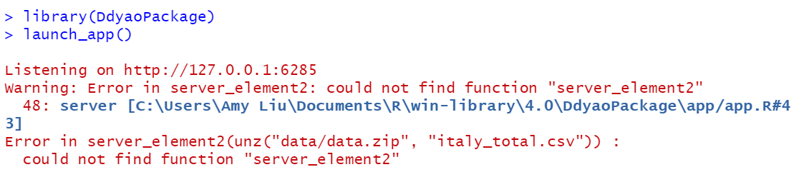
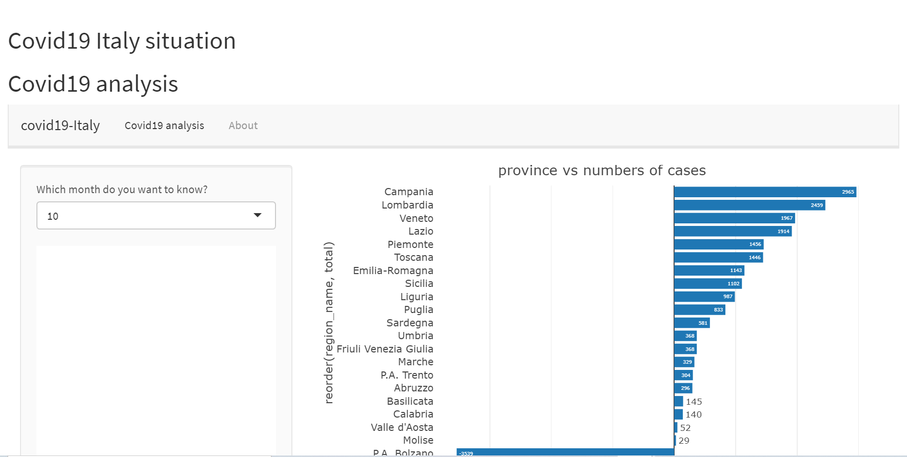

```{r setup, include=FALSE,message=FALSE,warning=FALSE}
knitr::opts_chunk$set(echo = TRUE)
```

Peer review is a useful tool to both receive feedback from your colleagues and reflect on how others solve problems similar that you may encounter.Now I will review another student's package and give some suggestion to help him improve.At the same time,I will learn something from it too.

### Overview of the package

The package is written by **Diyao Chen** and it is called **DdyaoPackage**.

People can install the package from [GitHub]("etc5523-2020/r-package-assessment-DDyao") with:

```{r}
# install.packages("devtools")
# devtools::install_github("etc5523-2020/r-package-assessment-DDyao")
```

The app in the package is use to analysis the COVID19 situation in Italy.

However,at first I cannot run the shiny app in the package.

```{r,echo=FALSE}

```


After that,I downloaded the whole files from the github and checked the code in the app.R and the server_element.R.I found that server_element2 function did not work,so I slightly modified the code and finally succeeded in running the shiny app.

```{r,echo=FALSE}

```

<br>

### What does the package do

The shiny app in the package wants to convey some information about the following two questions.

- primary question: What is the situation about COVID19 in Italy(each month)?
- secondary question: What is the situation for each province?

From the shiny app,I can get some useful information about the questions with the clear user interface and the understandable plot and table.

### About improvements

**1.Shiny App** 

Plots and table in the shiny app are interactive.Also the shiny app has a clear user interface and explanatory sentences,which are great. 

I think about the layout of this shiny app,Diyao could modify the color of the navigation bar,which would more effectively appeal people's attention.

**2.Functions**

Some of the functions like server_element() and ui_element() are simple but practical,which are great.However,other functions do not work because of some trivial problems like forgetting to export the function which is written in the r script.

I suggest that Diyao could try to write some more complicated functions in the future.At the same time,Diyao could become more careful to check the format of functions.

**3.Unit Test**

There are two unit tests in the package and they are functional.

The possible improvement could be that Diyao can try to write some more complicated unit test in the future. 

**4.Documentation**

About the description and readme,there are short of some detailed contents that introduce the package.While to the vignette,it is clear to tell people how to use the shiny app and what information this app wants to express.

Although in the shiny app, there is a section named about and it displays the overview of the dataset and the aim of the app,people just could know it after they download the package.So I suggest that Diyao could add more descriptive sentences in the readme file,which would give people who want to use the package a more detailed overview.

### Learn from reviewing the package

I learn a lot from reviewing another student's package.I learn how to insert the about section into the shiny app from the external rmarkdown file.Also I realize the importance of readme file.A good readme file can give people a brief introduction of the package and appeal them to download and use it,while a bad readme file would make people confused.

### Package Review

*Please check off boxes as applicable, and elaborate in comments below.*

#### Documentation

The package includes all the following forms of documentation:

- [X] **Installation instructions:** for the package is found in README
- [X] **Vignette(s)** demonstrating major functionality that runs successfully locally
- [X] **Function Documentation:** for all exported functions in R help
- [ ] **Examples** for all exported functions in R Help that run successfully locally

#### Functionality

- [X] **Installation:** Installation succeeds as documented.
- [X] **Functionality:** Any functional claims of the software been confirmed.
- [X] **Automated tests:** Unit tests cover essential functions of the package and a reasonable range of inputs and conditions. All tests pass on the local machine.

*  *  *  *